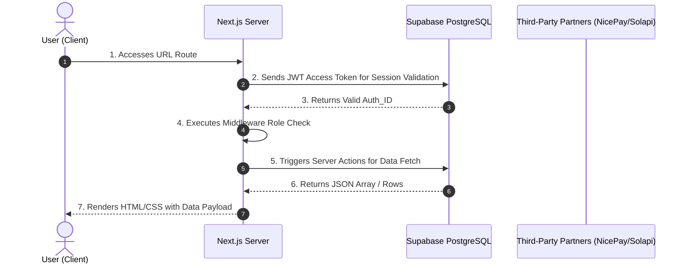

# [ENTERPRISE STANDARD] SOURCE CODE DOCUMENTATION & SPECIFICATION (ISO STANDARDS)

> **Scope**: This standard is mandatory for all 57 Pages, Background Tasks (Cron Jobs), and Micro-services within the CleanHi Project Ecosystem.
> **Classification**: Internal Confidential. Do not distribute outside R&D department premises.

---

## 10-STEP ARCHITECTURE OVERVIEW
Every Software Engineer or Business Analyst (BA) when creating or updating documentation for a CleanHi project page **MUST** review and complete the following 10 chapters:

---

## CHAPTER 1: DOCUMENT CONTROL & METADATA
Provides identification data for the page within the Next.js routing system.
- **Page ID**: `[e.g., ADM-ALY-01]`
- **Page Name**: `[e.g., Admin Analytics Dashboard]`
- **Physical File Path**: Absolute path from project root `src/...`
- **URL Route**: Web path (including Query Params and Dynamic Params like `[id]`).
- **Version & Owner**: Specify the engineer responsible and the last update date.

---

## CHAPTER 2: BUSINESS CONTEXT & VISION
Defines the page from a business perspective rather than just technical.
1. **Business Value**: Does this page generate revenue or improve user retention?
2. **Metrics & OKR**: Which company KPI increases when a user interacts here? (e.g., Matching Rate, Retention).

---

## CHAPTER 3: UI/UX TOPOLOGY
Strict guidelines on frontend implementation.
1. **Component Hierarchy**:
   - **Server Components**: Blocks rendered on the server.
   - **Client Components (`"use client"`)**: Blocks managing state (useState, Effects) and interactivity.
2. **Responsive States**:
   - Mobile viewport behavior (< 768px).
   - Desktop-only elements.
3. **Internal UI Libraries**: Usage of `Radix UI`, `shadcn/ui`, or `Recharts`.

---

## CHAPTER 4: SEQUENTIAL USER FLOW (MERMAIDJS)
Dynamic Sequence Diagrams are mandatory. Static descriptions are insufficient.

---

## CHAPTER 5: RBAC & SECURITY POSTURE
Risk assessment of the page.
1. **Access Matrix**:
   - Read/Write permission mapping.
   - Permission Keys: `[e.g., analytics.read, bookings.write]`
2. **Defense Mechanisms**:
   - CSRF protection validation.
   - Implementation of `assertAdminPermission()` or `requirePartnerSession()`.
3. **Fallback UI**: Usage of `redirect()` vs. `notFound()`.

---

## CHAPTER 6: DATA MODEL & SCHEMA CONTRACTS
Detailed specifications for Supabase interactions.
1. **Affected Target Tables**: Primary/Foreign keys and columns touched (`SELECT`, `UPDATE`, `INSERT`).
2. **Query Specifications**: Limits, Joins, and Filters.
3. **Row Level Security (RLS)**: Confirmation of strict adherence to PostgreSQL row-level protection. No unauthorized `createServiceClient()` bypasses.

---

## CHAPTER 7: BUSINESS LOGIC & SERVER ACTIONS
Description of Next.js Server Actions.
1. **Input Validation**: ZOD Schema definitions.
2. **Algorithms**: Idempotency checks (payment) and Realtime locks (bidding).
3. **Outbound Webhooks**: Calls to Solapi (Kakao) or SendGrid (Email).

---

## CHAPTER 8: PERFORMANCE & CACHING
Speed vs. Accuracy tradeoffs.
1. **Cache Directives**: `force-dynamic`, `force-static`, or ISR (`revalidate`).
2. **Lazy Loading**: Fragment-level `<Suspense>` boundaries for heavy components (e.g., charts) to keep FCP under 200ms.

---

## CHAPTER 9: OBSERVABILITY & ERROR TRACKING
Ensuring no "Silent Failures".
1. **Audit Logs**: Tracking `UPDATE/DELETE` mutations in the `audit_logs` table.
2. **Error Boundaries**: Handling DB downtime or Gateway maintenance. Proper `<EmptyState />` rendering.

---

## CHAPTER 10: QA & TESTING CRITERIA
Mandatory requirements for merging into the `main` branch.
1. **Unit Testing (Jest)**: Logic coverage > 80%.
2. **E2E Testing (Playwright/Cypress)**: Critical path validation and Mobile emulation.

---
*(End of Document)*

> **📝 Approval Signature**: Chief Architecture Officer / O2O Project Lead.
> **📌 Version**: VER-9.9 (Enterprise Grade).
