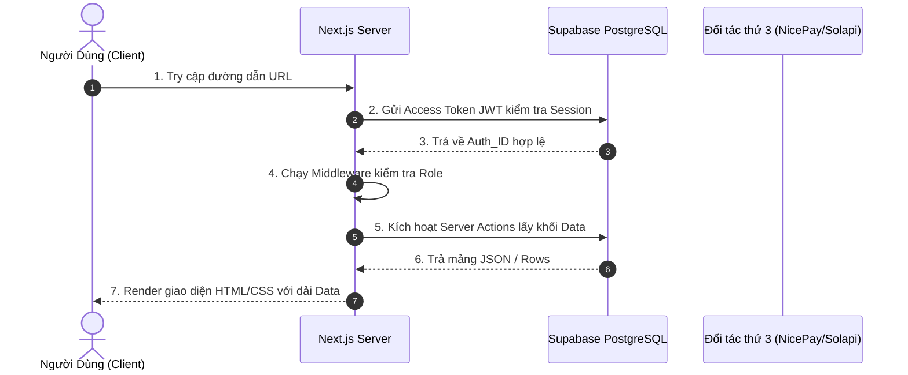

# [ENTERPRISE STANDARD] QUY TRÌNH & ĐẶC TẢ TÀI LIỆU HÓA MÃ NGUỒN TIÊU CHUẨN ISO

> **Phạm vi áp dụng (Scope)**: Tiêu chuẩn này áp dụng bắt buộc đối với toàn bộ 57 trang (Pages), các luồng tính toán nền (Cron Jobs), và các vi dịch vụ (Micro-services) thuộc Hệ sinh thái dự án CleanHi.
> **Tính chất tài liệu**: Bí mật nội bộ (Internal Confidential). Vui lòng không public ra bên ngoài khuôn viên bộ phận R&D.

---

## MỤC LỤC & CẤU TRÚC TIÊU CHUẨN 10 BƯỚC (THE 10-STEP ARCHITECTURE)
Bất cứ Kỹ sư phần mềm (Software Engineer) hay Chuyên viên Phân tích nghiệp vụ (BA) nào khi khởi tạo hoặc cập nhật Document cho 1 trang web thuộc dự án CleanHi, **BẮT BUỘC** phải rà soát và điền đầy đủ 10 chương sau đây:

---

## CHƯƠNG 1: KIỂM SOÁT TÀI LIỆU (DOCUMENT CONTROL & METADATA)
Mục này cung cấp dữ liệu định danh của Page trên hệ thống định tuyến (Routing) của Next.js.
- **Mã Màn Hình (Page ID)**: `[Ví dụ: ADM-ALY-01]`
- **Tên Màn Hình (Page Name)**: `[Ví dụ: Admin Analytics Dashboard]`
- **Tệp Nguồn (Physical File Path)**: Đường dẫn tuyệt đối tính từ gốc dự án `src/...`
- **Định tuyến URL (URL Route)**: Đường dẫn Web (Bao gồm Query Params và Dynamic Params: `[id]`).
- **Phiên bản & Tác giả (Version & Owner)**: Phải ghi rõ ai chịu trách nhiệm code trang này, ngày cập nhật gần nhất.

---

## CHƯƠNG 2: TỔNG QUAN NGHIỆP VỤ (BUSINESS CONTEXT & VISION)
Giải nghĩa trang web này dưới góc độ kinh doanh (Business Logic) thay vì góc độ kỹ thuật.
1. **Giá Trị Hệ Sinh Thái (Business Value)**: Trang này tạo ra dòng tiền hay giữ chân người dùng?
2. **Metrics & OKR**: Khi một User tương tác qua trang này, chỉ số nào của công ty sẽ tăng? (Ví dụ: Tăng Tỷ lệ chốt đơn Matching Rate, Tăng Customer Retention).

---

## CHƯƠNG 3: BỐ CỤC GIAO DIỆN & TỔNG QUAN UI/UX (UI/UX TOPOLOGY)
Quy định khắt khe về việc triển khai Code giao diện hiển thị cho người xem.
1. **Phân rã Component (Component Hierarchy)**:
   - Các Server Component (`Server`): Khối nào được Load từ máy chủ.
   - Các Client Component (`"use client"`): Khối nào quản lý trạng thái (useState, Effects) và Tương tác (Click, Hover).
2. **Hành Vi Khung Hình (Responsive States)**:
   - Thay đổi thế nào trên Mobile viewport (dưới 768px).
   - Thiết kế nào bị ẩn đi (Hidden) trên Desktop.
3. **Thư viện UI Nội Bộ (UI Libs)**: Form sử dụng `Radix UI`, `shadcn/ui`, hay đồ thị sử dụng `Recharts`.

---

## CHƯƠNG 4: HÀNH TRÌNH NGƯỜI DÙNG & BIỂU ĐỒ TUẦN TỰ (SEQUENTIAL USER FLOW)
Bắt buộc vẽ sơ đồ Hệ Thống Động (Dynamic Sequence Diagram) sử dụng MermaidJS. Không biểu diễn tĩnh.

---

## CHƯƠNG 5: MA TRẬN PHÂN QUYỀN & AN NINH MẠNG (RBAC & SECURITY POSTURE)
Đánh giá độ rủi ro (Risk Level) của Trang web.
1. **Ma Trận Truy Cập (Access Matrix)**:
   - Ai được gọi lệnh Đọc (Read)? Ai được gọi lệnh Ghi/Sửa (Write/Mutate)?
   - Mã khóa Permission: `[Ví dụ: analytics.read, bookings.write]`
2. **Kỹ thuật Phòng Thủ (Defense Mechanisms)**:
   - Phải chứng minh code đã ngăn chặn tấn công giả mạo (CSRF).
   - Đã nhúng hàm bọc Cấp rào `assertAdminPermission()` hay `requirePartnerSession()` vào chưa?
3. **Mạng rớt / Từ chối phục vụ (Fallback UI)**: Chuyển hướng mềm (`redirect()`) hay ném Lỗi Cứng (`notFound()`).

---

## CHƯƠNG 6: MÔ HÌNH VÀ KIẾN TRÚC DỮ LIỆU (DATA MODEL & SCHEMA CONTRACTS)
Liệt kê chi tiết các dòng lệnh chọc thẳng vào Supabase. Phải cực kỳ tường minh.
1. **Bảng Bị Tác Động (Affected Target Tables)**: 
   - Liệt kê Primary Key, Foreign Key. 
   - Những cột (Columns) nào sẽ bị dính lệnh `SELECT`, `UPDATE` hay `INSERT`.
2. **Truy vấn cụ thể (Query Specifications)**:
   - Có Limit không? (VD: `limit(50)`).
   - Có Join bảng ngoại không? (VD: `select('*, profiles(name, avatar)')`).
3. **Rào Cản RLS (Row Level Security)**: 
   - Khẳng định 100% trang tuân theo khóa bảo vệ Dòng của PosgreSQL.
   - Cấm lạm dụng \`createServiceClient()\` (Bypass RLS) trừ khi trang này thuộc Admin.

---

## CHƯƠNG 7: XỬ LÝ LÕI NGHIỆP VỤ & ACTION HOOKS (BUSINESS LOGIC EXECUTION)
Nơi mô tả toàn bộ Server Actions (API ẩn của Next.js).
1. **Xác thực Đầu vào (Input Validation)**: Dùng sơ đồ ZOD Schema nào để bắt lỗi nếu khách hàng cố tình điền chữ vào ô điền số? (`Zod.string().email()`, `Zod.number().min(100)`).
2. **Giải Thuật Thao Tác (Algorithms)**: 
   - Nếu là luồng thanh toán: Phải giải trình được cơ chế Chống Trùng lặp Idempotency (Tránh trừ tiền khách 2 lần).
   - Nếu là luồng đấu giá: Cơ chế Realtime khóa cổng sau 5 Bids hoạt động ra sao.
3. **Gọi API Bên Ngoài (Outbound Webhooks)**: Có đính kèm lệnh gọi Solapi (Nhắn tin Zalo) hay SendGrid (Email) không?

---

## CHƯƠNG 8: QUẢN TRỊ HIỆU SUẤT & TỐI ƯU CƠ ĐỘNG (PERFORMANCE & CACHING)
Xác định trang web này ưu tiên Tốc Độ Load (Speed) hay Độ Chính Xác (Realtime Accuracy).
1. **Chiến Lược Cache (Cache Directives)**: 
   - Khai báo \`force-dynamic\` (Live, không cache, tốn tài nguyên Server Vercel).
   - Khai báo \`force-static\` (Build 1 lần chạy mãi mãi, siêu tốc).
   - Khai báo ISR (\`revalidate = 3600\`) - 1 Tiếng dọn Cache làm mới 1 lần.
2. **Kỹ thuật tải nhẹ (Lazy Loading & Suspense)**: Liệt kê các Fragment \`<Suspense fallback={...}>\` bao bọc các Component dữ liệu chậm (như Biểu đồ Recharts) để giúp luồng HTML sườn Load trong dưới 200 miligiây.

---

## CHƯƠNG 9: GIÁM SÁT VIỄN TRẮC & GHI LOGS (OBSERVABILITY & ERROR TRACKING)
Hệ thống không được chết im lặng (Silent Failures). Mọi cái chết phải để lại Dấu vết.
1. **Ghi Nhật Ký (Audit Logs)**: Bất kì thao tác `UPDATE/DELETE` nào ở trang này có gọi hàm chèn dữ liệu gầm vào bảng `audit_logs` để thanh tra sau này không? 
2. **Quản lý Vỡ Form (Error Boundaries)**: 
   - Liệt kê các trạng thái: Mất kết nối DB? Ngân hàng NicePay bảo trì? 
   - Bắt buộc trả về thẻ UI rỗng \`<EmptyState />\` khi Data mảng = 0 (Length = 0).

---

## CHƯƠNG 10: TIÊU CHUẨN NGHIỆM THU KIỂM THỬ (QA & TESTING CRITERIA)
Yêu cầu bắt buộc để Trang Web này được phép cấp quyền Merge vào nhánh Code Main.
1. **Kịch bản Unit Test (Jest)**: Phải chặn các hàm bóc tách dữ liệu Logic tính tiền (Test coverage > 80%).
2. **Kịch bản E2E Test (Playwright/Cypress)**: 
   - Khách bấm Flow này bị tắc ở đâu? 
   - Test UI trên môi trường thiết bị di động (Mobile Emulation).

---
*(Hết tài liệu)*

> **📝 Chữ ký phê duyệt tiêu chuẩn**: Quản đốc Kiến trúc (Chief Architecture Officer) / Lead Đội Dự Án O2O CleanHi.
> **📌 Phiên bản Guideline**: VER-9.9 (Enterprise Grade). Đạt tiêu chuẩn phân phối cho Vendor gia công quốc tế.
