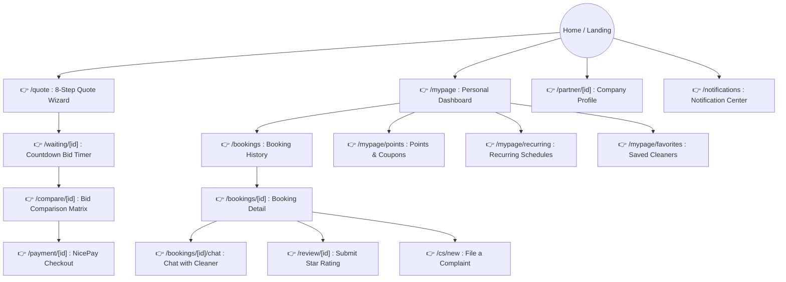
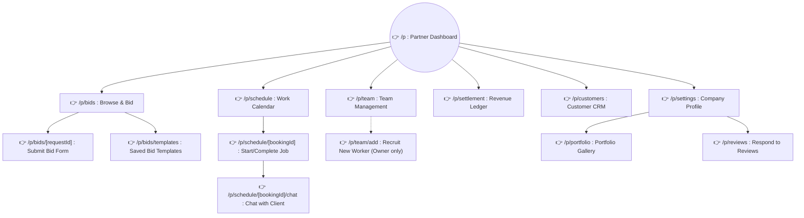
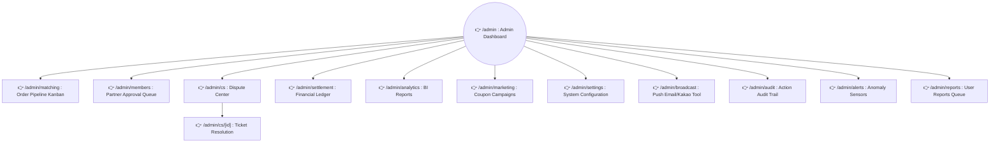

# PAGE ARCHITECTURE & URL ROUTING MAP

The CleanHi project is divided into 3 Portals (entry gates) corresponding to 3 user types. Below is a detailed diagram integrating the actual URL routes derived from the Next.js App Router structure (`src/app`).

---

## 1. Customer Portal (Route Prefix: `/`)
**Purpose**: Enable customers to submit cleaning requests, compare bids, pay, and interact with support. (Mobile-first design.)

---

## 2. Partner Portal (Route Prefix: `/p/`)
**Purpose**: Workspace for cleaning companies (Lead/Owner) and field workers to discover jobs, submit bids, and manage schedules.

---

## 3. Admin Portal (Route Prefix: `/admin/`)
**Purpose**: Desktop-first operations workbench for Ops/CS/Marketing teams running the entire marketplace.

---

## Absolute URL Reference Table (From Next.js App Router)

### Route `/` (Customer & Public)
- Guest pages: `/` (Landing), `/legal/privacy`, `/legal/terms`
- Quote funnel: `/quote` → `/waiting/[id]` → `/compare/[id]` → `/payment/[id]`
- Booking management: `/bookings`, `/bookings/[id]`, `/bookings/[id]/chat`
- Profile: `/mypage`, `/mypage/favorites`, `/mypage/points`, `/mypage/recurring-new`
- Support: `/cs/new`, `/review/[id]`, `/partner/[id]`

### Route `/p/` (Partner Company)
- Overview: `/p`, `/p/settings`
- Bidding: `/p/bids`, `/p/bids/[requestId]`, `/p/bids/templates`
- Schedule: `/p/schedule`, `/p/schedule/[bookingId]`, `/p/schedule/[bookingId]/chat`
- Finance & HR: `/p/settlement`, `/p/team`, `/p/team/add`, `/p/customers`, `/p/portfolio`, `/p/reviews`

### Route `/admin/` (System Control)
- Analytics: `/admin`, `/admin/analytics`, `/admin/matching`
- Finance & Users: `/admin/settlement`, `/admin/members`
- CS & Tools: `/admin/cs`, `/admin/cs/[id]`, `/admin/marketing`, `/admin/broadcast`
- Security: `/admin/settings`, `/admin/audit`, `/admin/alerts`, `/admin/reports`