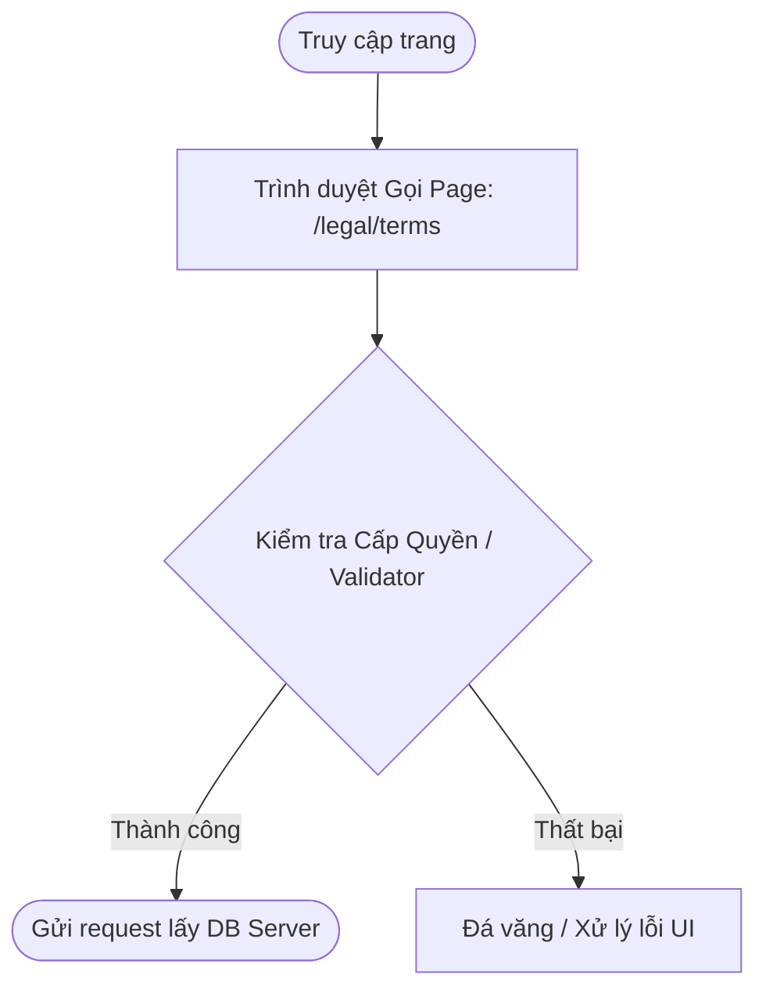

# DOC CHI TIẾT TRANG: LEGAL TERMS
- **Tệp Nguồn Code**: `src/app/legal/terms/page.tsxpage.tsx`
- **Đường Dẫn URL**: `/legal/terms`

---

## 1. Bản Vẽ Luồng Người Dùng (Luồng Hoạt Động Cốt Lõi)

- **Mô Tả Chức Năng**: Giao diện cốt lõi (Core Engine) đứng ra fetch và hiển thị dữ liệu cho luồng định tuyến /legal/terms.

## 2. Phân Quyền Truy Cập (Security RBAC)
- **Nhóm Cho phép**: Mọi người (Public)
- **Bảo mật**: Không yêu cầu trạng thái đăng nhập.

## 3. Kiến Trúc Cơ Sở Dữ Liệu
- Màn hình tĩnh, không gọi Database nặng.
- **Bảo mật SQL**: Chốt chặn truy vấn tuân theo quy tắc khai báo RLS (Supabase Row-Level-Security).

## 4. Đặc Điểm Mã Nguồn & Hàm Gọi
- **Chiến lược Hiển Thị**: Trang Server Components (Tự động cập nhật sống force-dynamic).
- **Mã Kính Hiển Vi UI**: Giao diện hành vi "nhấp chuột / nhập liệu" đều được tách lẻ ra "use client" để chống tình trạng treo nghẽn bộ vi xử lý Server Vercel.

## 5. Xử Lý Ngoại Lệ & Lỗi Triển Khai
- **Sốc Nguồn Mạng**: Sẽ kích hoạt Lỗi Hệ Thống Lõi (Native Error Boundary).
- **Dữ liệu mồ côi (Trống)**: Được quy chuẩn hóa đổ bóng render khung `<EmptyState />` khi Data Database trả về biến 0 dòng.