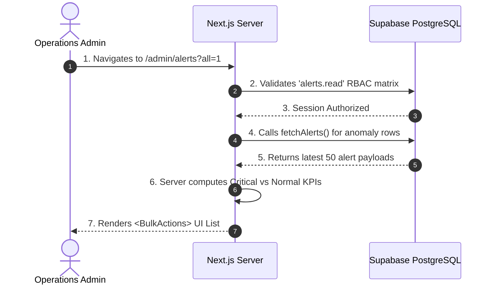

# [ENTERPRISE STANDARD] PAGE DOCUMENTATION: ADMIN ALERTS

> **Scope**: Application to internal system route `/admin/alerts` within the CleanHi ecosystem.
> **Classification**: Internal Confidential.

---

## CHAPTER 1: DOCUMENT CONTROL & METADATA
- **Page ID**: `ADM-ALRT-03`
- **Page Name**: Anomaly Detection Viewer (Admin Alerts)
- **Physical File Path**: `src/app/(admin)/admin/alerts/page.tsx`
- **URL Route**: `/admin/alerts?all=[0|1]`
- **Version Release**: Phase 3 · Stream D

---

## CHAPTER 2: BUSINESS CONTEXT & VISION
1. **Business Value**: Functions as the primary "Early Warning Radar" for Operations. By centralizing unhandled system failures (orphaned payments, no-shows), it directly prevents revenue leakage and mitigates fatal customer churn.
2. **Metrics & OKR**: Directly impacts **Customer Retention Rate (CRR)** and **Average Ticket Resolution Time**. Successful utilization of this page decreases user disputes by proactively handling edge cases.

---

## CHAPTER 3: UI/UX TOPOLOGY
1. **Component Hierarchy**:
   - `Server`: Fetches anomalous rows natively within the React Server Component. Computes inline `unresolvedCount` and `criticalCount`.
   - `"use client"`: Delegates interactivity to `<BulkActions rows={rows} />`, enabling operators to batch-resolve multiple system alerts via checkboxes without repeatedly blocking the main server thread.
2. **Responsive States**: Optimized heavily for desktop viewports given the complex administrative table tracking required.
3. **UI Libs**: Utilizes Tailwind CSS grid and standard Next.js `<Link>` components for Tab switching (Unresolved vs. All). Critical alerts automatically mount high-contrast red warning badges (`bg-red-100`).

---

## CHAPTER 4: SEQUENTIAL USER FLOW

---

## CHAPTER 5: RBAC & SECURITY POSTURE
1. **Access Matrix**:
   - **Allowed**: `super`, `ops` (Mapped via `alerts.read` permission context).
   - **Blocked**: `cs`, `marketing`, Partners, and Customers.
2. **Defense Mechanisms**: Protected strictly by enterprise middleware matrix mapping (`admin-permissions.ts`).
3. **Fallback UI**: Unauthorized users executing `fetchAlerts` trigger a forced HTTP exception, aggressively bubbling up to the nearest `error.tsx` crash boundary to prevent data bleeding.

---

## CHAPTER 6: DATA MODEL & SCHEMA CONTRACTS
1. **Affected Target Tables**:
   - Primary targeted views center strictly around `alerts` generated dynamically by the CRON ecosystem.
   - **Operation**: `SELECT` ONLY (from this file). Mutations happen inside `<BulkActions />`.
2. **Query Specifications**:
   - Enforces a hard `limit(50)` sorted by reverse-chronological time blocks to prevent memory overloads.
   - Evaluates URL parameter `?all=1` to configure conditional `includeResolved` boolean parameters natively injected into `fetchAlerts`.
3. **Row Level Security**: Operates behind the Phase 26 Migration Rules. Strictly isolated from external row modifications. 

---

## CHAPTER 7: BUSINESS LOGIC EXECUTION
1. **Input Validation**: Evaluates structural search params via internal helper function `pickString(v)` safely casting unknown arrays/strings into bounded valid inputs.
2. **Algorithm Triggers**: 
   - Tracks 5 background Cron rules explicitly: Delayed Booking, Partner No-Show, High Refund Volume, Orphaned Payment, and Settlement Delay.
   - Critical triggers (e.g., `severity === "critical"`) generate internal flags bypassing standard UX to escalate issue urgency dynamically.
3. **Outbound Webhooks**: None directly established in `page.tsx`. High-severity alerts queue asynchronous in-app push deliveries at the Cron-level instead.

---

## CHAPTER 8: PERFORMANCE & CACHING
1. **Cache Directives**: Strictly implements `export const dynamic = "force-dynamic"`. Because anomaly metrics are hyper-fluid and critical, cached static generation is deemed unsafe. Refreshes live from Database every F5.
2. **Lazy Loading Isolation**: Encapsulates the dense looping logic into the `<BulkActions />` prop boundary, deferring interactive JavaScript hydration burdens solely to client endpoints.

---

## CHAPTER 9: OBSERVABILITY & ERROR TRACKING
1. **Audit Logs**: Interactions routed via `<BulkActions>` natively hook into `audit_logs` inserts, assuring internal compliance whenever an operator forces an alert parameter to `resolved`.
2. **Error Boundaries**: 
   - Returns a structured abstract block `<EmptyState />` UI (e.g., "Normal Status. No ongoing anomalies.") if Array lengths equate to `0`, ensuring Ops admins do not suspect a UI freeze.

---

## CHAPTER 10: QA & TESTING CRITERIA
1. **Unit Test Requirements**: Assure backend API routes mapping `includeResolved` strictly retrieve nullified timestamps.
2. **E2E Test Scenarios**: 
   - Simulate a failed payment attempt triggering an Alert injection.
   - Validate Admin portal URL parameter transitions flawlessly swapping active CSS tabs depending on `?all=1` toggle.