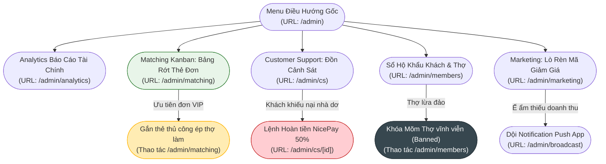

# LUỒNG ĐI PHÂN PHỐI QUẢN TRỊ VIÊN (ADMIN)

*Mục tiêu: Chóp bu đứng trên cao nhìn xuống toàn bộ thiên hạ, gạt tay phán xử thẻ bài.*

```mermaid
graph TD
    A(["Menu Điều Hướng Gốc<br/>(URL: /admin)"]) --> B(["Analytics Báo Cáo Tài Chính<br/>(URL: /admin/analytics)"])
    A --> C(["Matching Kanban: Bảng Rớt Thẻ Đơn<br/>(URL: /admin/matching)"])
    A --> D(["Customer Support: Đồn Cảnh Sát<br/>(URL: /admin/cs)"])
    A --> E(["Sổ Hộ Khẩu Khách & Thợ<br/>(URL: /admin/members)"])
    A --> F(["Marketing: Lò Rèn Mã Giảm Giá<br/>(URL: /admin/marketing)"])
    
    C -->|Ưu tiên đơn VIP| G(["Gắn thẻ thủ công ép thợ làm<br/>(Thao tác /admin/matching)"])
    D -->|Khách khiếu nại nhà dơ| H(["Lệnh Hoàn tiền NicePay 50%<br/>(URL: /admin/cs/[id])"])
    E -->|Thợ lừa đảo| I(["Khóa Mõm Thợ vĩnh viễn (Banned)<br/>(Thao tác /admin/members)"])
    F -->|Ế ẩm thiếu doanh thu| J(["Dội Notification Push App<br/>(URL: /admin/broadcast)"])

    style C fill:#e8f5e9,stroke:#2e7d32
    style G fill:#ffecb3,stroke:#ffb300
    style H fill:#ffcdd2,stroke:#c62828
    style I fill:#37474f,stroke:#263238,color:#fff
```
