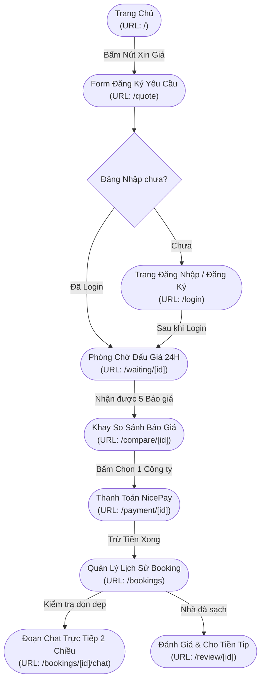

# LUỒNG ĐI CỦA KHÁCH HÀNG (CUSTOMER)

*Mục tiêu: Dẫn dắt khách đi từ lúc xin giá đến lúc rớt tiền và đánh giá thợ.*

```mermaid
graph TD
    A(["Trang Chủ<br/>(URL: /)"]) -->|Bấm Nút Xin Giá| B(["Form Đăng Ký Yêu Cầu<br/>(URL: /quote)"])
    B --> C{Đăng Nhập chưa?}
    C -->|Chưa| D(["Trang Đăng Nhập / Đăng Ký<br/>(URL: /login)"])
    C -->|Đã Login| E(["Phòng Chờ Đấu Giá 24H<br/>(URL: /waiting/[id])"])
    D -->|Sau khi Login| E
    E -->|Nhận được 5 Báo giá| F(["Khay So Sánh Báo Giá<br/>(URL: /compare/[id])"])
    F -->|Bấm Chọn 1 Công ty| G(["Thanh Toán NicePay<br/>(URL: /payment/[id])"])
    G -->|Trừ Tiền Xong| H(["Quản Lý Lịch Sử Booking<br/>(URL: /bookings)"])
    H -->|Kiểm tra dọn dẹp| I(["Đoạn Chat Trực Tiếp 2 Chiều<br/>(URL: /bookings/[id]/chat)"])
    H -->|Nhà đã sạch| J(["Đánh Giá & Cho Tiền Tip<br/>(URL: /review/[id])"])
    
```
