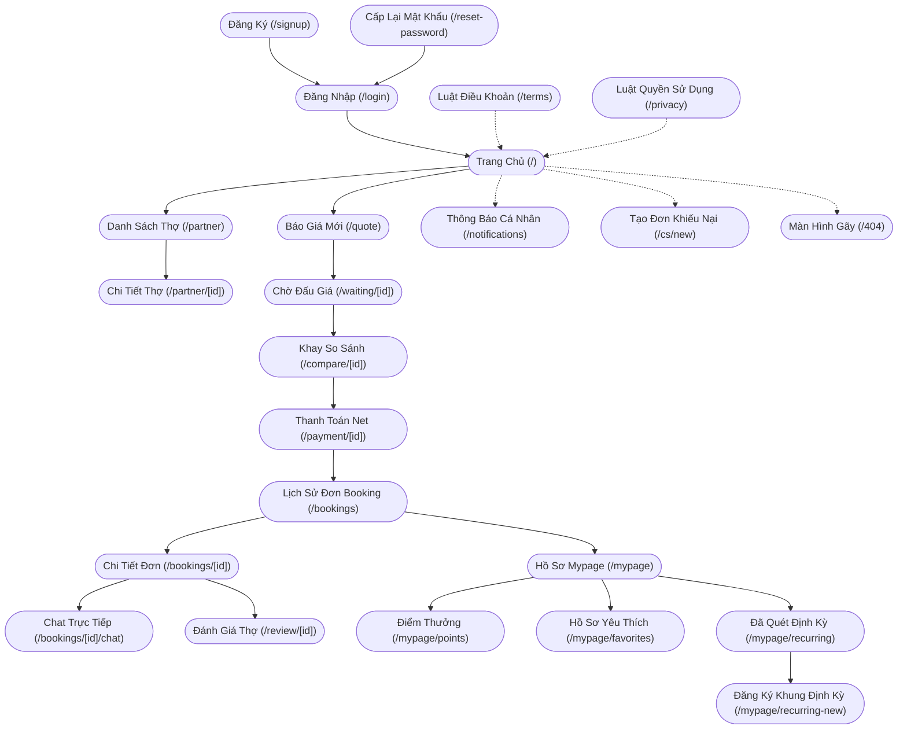

# BẢN ĐỒ CHUỖI GIAO DIỆN KHÁCH HÀNG (CUSTOMER & AUTH)
*Gồm: 18 trang nghiệp vụ User + 6 Trang Auth/Pháp lý (Tổng 24 Trang)*

```mermaid
graph TD
    %% Khối Auth & Pháp Lý
    L2(["Đăng Ký (/signup)"]) --> L1(["Đăng Nhập (/login)"])
    L3(["Cấp Lại Mật Khẩu (/reset-password)"]) --> L1
    
    %% Khối Khám Phá
    L1 --> H(["Trang Chủ (/)"])
    H --> Q(["Báo Giá Mới (/quote)"])
    H --> P1(["Danh Sách Thợ (/partner)"])
    P1 --> P2(["Chi Tiết Thợ (/partner/[id])"])

    %% Khối Lõi Thực Thi
    Q --> W(["Chờ Đấu Giá (/waiting/[id])"])
    W --> C(["Khay So Sánh (/compare/[id])"])
    C --> P(["Thanh Toán Net (/payment/[id])"])
    P --> B1(["Lịch Sử Đơn Booking (/bookings)"])
    B1 --> B2(["Chi Tiết Đơn (/bookings/[id])"])
    B2 --> B3(["Chat Trực Tiếp (/bookings/[id]/chat)"])
    B2 --> R(["Đánh Giá Thợ (/review/[id])"])

    %% Khối Quản Trị Khách
    B1 --> M1(["Hồ Sơ Mypage (/mypage)"])
    M1 --> M2(["Điểm Thưởng (/mypage/points)"])
    M1 --> M3(["Hồ Sơ Yêu Thích (/mypage/favorites)"])
    M1 --> M4(["Đã Quét Định Kỳ (/mypage/recurring)"])
    M4 --> M5(["Đăng Ký Khung Định Kỳ (/mypage/recurring-new)"])
    
    %% Hỗ Trợ Rời Rạc
    H -.-> N1(["Thông Báo Cá Nhân (/notifications)"])
    H -.-> CS(["Tạo Đơn Khiếu Nại (/cs/new)"])
    H -.-> L6(["Màn Hình Gãy (/404)"])
    L4(["Luật Điều Khoản (/terms)"]) -.-> H
    L5(["Luật Quyền Sử Dụng (/privacy)"]) -.-> H
```