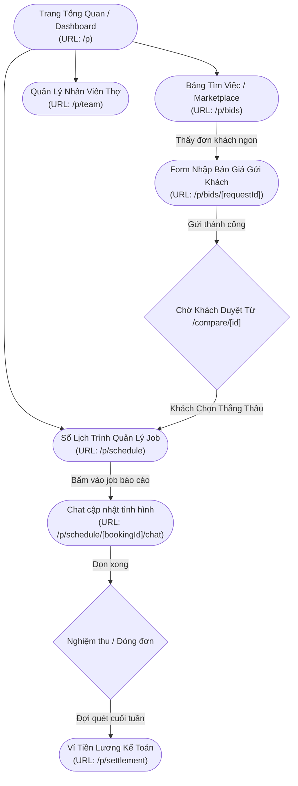

# LUỒNG ĐI CỦA CÔNG TY ĐỐI TÁC THI CÔNG (PARTNER)

*Mục tiêu: Đẩy thợ vào tìm việc, nộp đơn lấy tiền và quản lý nhân viên.*

```mermaid
graph TD
    A(["Trang Tổng Quan / Dashboard<br/>(URL: /p)"]) --> B(["Bảng Tìm Việc / Marketplace<br/>(URL: /p/bids)"])
    A --> C(["Sổ Lịch Trình Quản Lý Job<br/>(URL: /p/schedule)"])
    A --> D(["Quản Lý Nhân Viên Thợ<br/>(URL: /p/team)"])
    
    B -->|Thấy đơn khách ngon| E(["Form Nhập Báo Giá Gửi Khách<br/>(URL: /p/bids/[requestId])"])
    E -->|Gửi thành công| F{"Chờ Khách Duyệt Từ /compare/[id]"}
    F -->|Khách Chọn Thắng Thầu| C
    
    C -->|Bấm vào job báo cáo| G(["Chat cập nhật tình hình<br/>(URL: /p/schedule/[bookingId]/chat)"])
    G -->|Dọn xong| H{"Nghiệm thu / Đóng đơn"}
    H -->|Đợi quét cuối tuần| I(["Ví Tiền Lương Kế Toán<br/>(URL: /p/settlement)"])
    
```
