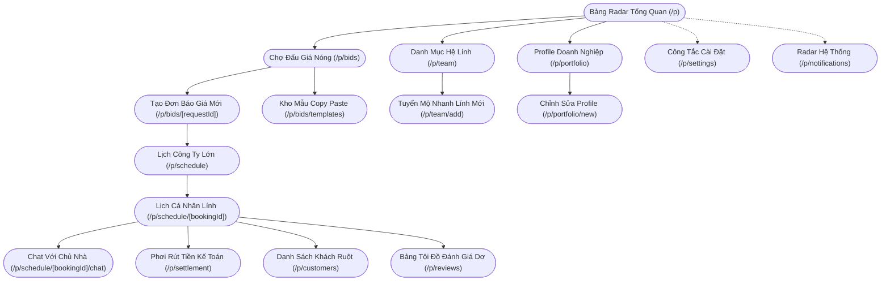

# BẢN ĐỒ CHUỖI GIAO DIỆN ĐỐI TÁC (PARTNER PORTAL)
*Gồm: Thiết lập thầu, Tác chiến chạy đơn và Mở Công ty (Tổng 16 Trang)*

```mermaid
graph TD
    D(["Bảng Radar Tổng Quan (/p)"])

    %% Chợ Bids
    D --> B1(["Chợ Đấu Giá Nóng (/p/bids)"])
    B1 --> B2(["Tạo Đơn Báo Giá Mới (/p/bids/[requestId])"])
    B1 --> B3(["Kho Mẫu Copy Paste (/p/bids/templates)"])

    %% Lịch Trình
    B2 --> S1(["Lịch Công Ty Lớn (/p/schedule)"])
    S1 --> S2(["Lịch Cá Nhân Lính (/p/schedule/[bookingId])"])
    S2 --> S3(["Chat Với Chủ Nhà (/p/schedule/[bookingId]/chat)"])
    
    %% Kế Toán & Uy Tín
    S2 --> F1(["Phơi Rút Tiền Kế Toán (/p/settlement)"])
    S2 --> C1(["Danh Sách Khách Ruột (/p/customers)"])
    S2 --> R1(["Bảng Tội Đồ Đánh Giá Dơ (/p/reviews)"])

    %% Bộ Máy Điều Hành
    D --> T1(["Danh Mục Hệ Lính (/p/team)"])
    T1 --> T2(["Tuyển Mộ Nhanh Lính Mới (/p/team/add)"])
    D --> P1(["Profile Doanh Nghiệp (/p/portfolio)"])
    P1 --> P2(["Chỉnh Sửa Profile (/p/portfolio/new)"])
    
    %% System
    D -.-> SET(["Công Tắc Cài Đặt (/p/settings)"])
    D -.-> NOT(["Radar Hệ Thống (/p/notifications)"])
```