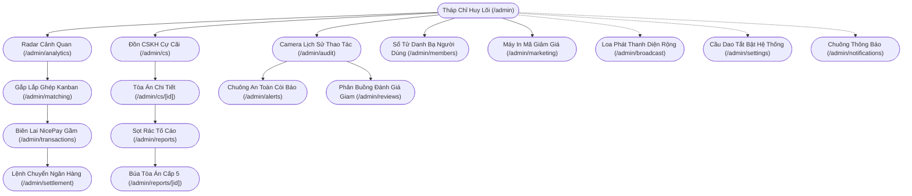

# BẢN ĐỒ CHUỖI ĐIỀU HƯỚNG QUẢN TRỊ VIÊN CẤP CAO (ADMIN)
*Phân bố hệ thống theo Cấp độ rủi ro Data quyền hạn (Tổng 17 Trang)*

```mermaid
graph TD
    A(["Tháp Chỉ Huy Lõi (/admin)"])

    %% Phân tích & Lắp ghépp
    A --> F1(["Radar Cảnh Quan (/admin/analytics)"])
    F1 --> D1(["Gắp Lắp Ghép Kanban (/admin/matching)"])
    D1 --> F2(["Biên Lai NicePay Gầm (/admin/transactions)"])
    F2 --> F3(["Lệnh Chuyển Ngân Hàng (/admin/settlement)"])

    %% CSKH & Tố Cáo
    A --> D2(["Đồn CSKH Cự Cãi (/admin/cs)"])
    D2 --> D3(["Tòa Án Chi Tiết (/admin/cs/[id])"])
    D3 --> R3(["Sọt Rác Tố Cáo (/admin/reports)"])
    R3 --> R4(["Búa Tòa Án Cấp 5 (/admin/reports/[id])"])
    
    %% An Ninh & Tù Tội
    A --> R2(["Camera Lịch Sử Thao Tác (/admin/audit)"])
    R2 --> R1(["Chuông An Toàn Còi Báo (/admin/alerts)"])
    R2 --> R5(["Phân Buồng Đánh Giá Giam (/admin/reviews)"])

    %% Global Entity
    A --> M3(["Sổ Tử Danh Bạ Người Dùng (/admin/members)"])
    A --> M2(["Máy In Mã Giảm Giá (/admin/marketing)"])
    A -.-> M1(["Loa Phát Thanh Diện Rộng (/admin/broadcast)"])
    A -.-> S1(["Cầu Dao Tắt Bật Hệ Thống (/admin/settings)"])
    A -.-> N1(["Chuông Thông Báo (/admin/notifications)"])
```