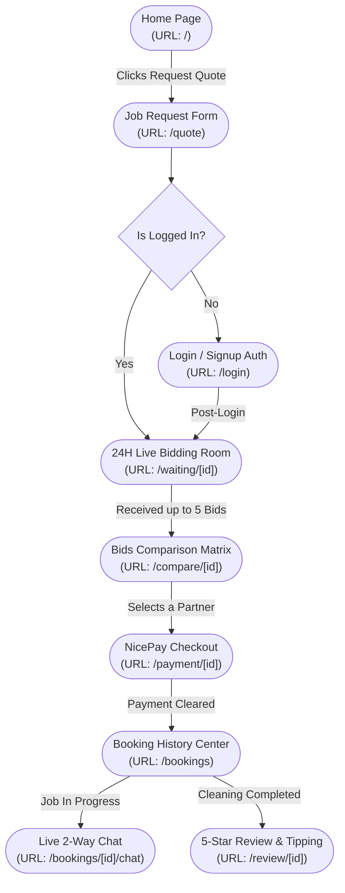

# CUSTOMER JOURNEY FLOW (ENGLISH)

*Objective: Guide the user from requesting a quote to tipping the partner post-service.*

```mermaid
graph TD
    A(["Home Page<br/>(URL: /)"]) -->|Clicks Request Quote| B(["Job Request Form<br/>(URL: /quote)"])
    B --> C{"Is Logged In?"}
    C -->|No| D(["Login / Signup Auth<br/>(URL: /login)"])
    C -->|Yes| E(["24H Live Bidding Room<br/>(URL: /waiting/[id])"])
    D -->|Post-Login| E
    E -->|Received up to 5 Bids| F(["Bids Comparison Matrix<br/>(URL: /compare/[id])"])
    F -->|Selects a Partner| G(["NicePay Checkout<br/>(URL: /payment/[id])"])
    G -->|Payment Cleared| H(["Booking History Center<br/>(URL: /bookings)"])
    H -->|Job In Progress| I(["Live 2-Way Chat<br/>(URL: /bookings/[id]/chat)"])
    H -->|Cleaning Completed| J(["5-Star Review & Tipping<br/>(URL: /review/[id])"])
    
```
