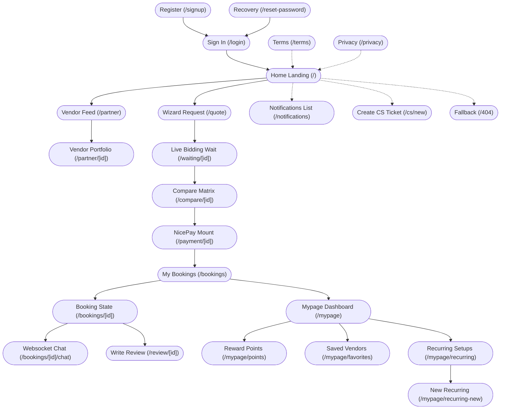

# FULL SITEMAP: CUSTOMER JOURNEY & PUBLIC GATES
*Coverage: 18 User Module Nodes + 6 Auth/Legal Nodes (Total 24 Nodes)*

```mermaid
graph TD
    %% Auth Block
    L2(["Register (/signup)"]) --> L1(["Sign In (/login)"])
    L3(["Recovery (/reset-password)"]) --> L1
    
    %% Discovery Block
    L1 --> H(["Home Landing (/)"])
    H --> Q(["Wizard Request (/quote)"])
    H --> P1(["Vendor Feed (/partner)"])
    P1 --> P2(["Vendor Portfolio (/partner/[id])"])

    %% Core Funnel
    Q --> W(["Live Bidding Wait (/waiting/[id])"])
    W --> C(["Compare Matrix (/compare/[id])"])
    C --> P(["NicePay Mount (/payment/[id])"])
    P --> B1(["My Bookings (/bookings)"])
    B1 --> B2(["Booking State (/bookings/[id])"])
    B2 --> B3(["Websocket Chat (/bookings/[id]/chat)"])
    B2 --> R(["Write Review (/review/[id])"])

    %% User Preferences Rooted Logically
    B1 --> M1(["Mypage Dashboard (/mypage)"])
    M1 --> M2(["Reward Points (/mypage/points)"])
    M1 --> M3(["Saved Vendors (/mypage/favorites)"])
    M1 --> M4(["Recurring Setups (/mypage/recurring)"])
    M4 --> M5(["New Recurring (/mypage/recurring-new)"])
    
    %% Orphans / Supporting Nodes
    H -.-> N1(["Notifications List (/notifications)"])
    H -.-> CS(["Create CS Ticket (/cs/new)"])
    H -.-> L6(["Fallback (/404)"])
    L4(["Terms (/terms)"]) -.-> H
    L5(["Privacy (/privacy)"]) -.-> H
```