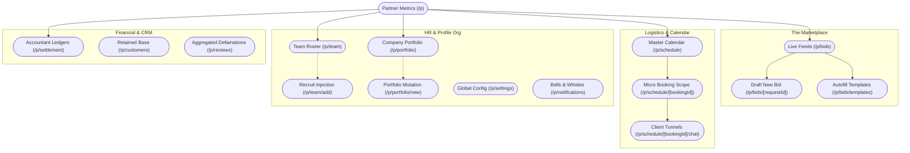

# FULL SITEMAP: SUBCONTRACTOR MODULE OVERVIEW
*Coverage: Bidding Engine, Dispatch Ops, and Org Management (Total 16 Nodes)*

```mermaid
graph TD
    D(["Partner Metrics (/p)"])

    subgraph Bidding_Zone [The Marketplace]
        B1(["Live Feeds (/p/bids)"])
        B2(["Draft New Bid (/p/bids/[requestId])"])
        B3(["Autofill Templates (/p/bids/templates)"])
    end

    subgraph Operations [Logistics & Calendar]
        S1(["Master Calendar (/p/schedule)"])
        S2(["Micro Booking Scope (/p/schedule/[bookingId])"])
        S3(["Client Tunnels (/p/schedule/[bookingId]/chat)"])
    end

    subgraph Company_Mgmt [HR & Profile Org]
        T1(["Team Roster (/p/team)"])
        T2(["Recruit Injection (/p/team/add)"])
        P1(["Company Portfolio (/p/portfolio)"])
        P2(["Portfolio Mutation (/p/portfolio/new)"])
        SET(["Global Config (/p/settings)"])
        NOT(["Bells & Whisles (/p/notifications)"])
    end

    subgraph Accounting_CRM [Financial & CRM]
        F1(["Accountant Ledgers (/p/settlement)"])
        C1(["Retained Base (/p/customers)"])
        R1(["Aggregated Defamations (/p/reviews)"])
    end

    D --> B1 & S1 & F1 & T1 & P1
    B1 --> B2 & B3
    S1 --> S2 --> S3
    T1 -.-> T2
    P1 -.-> P2
```