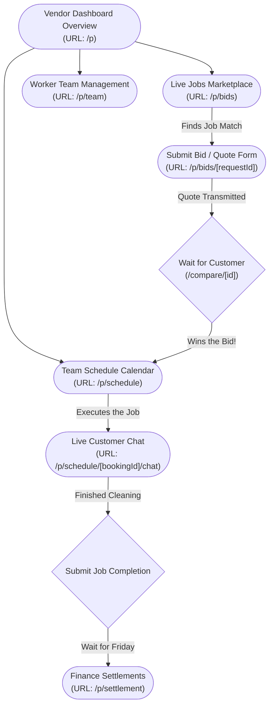

# SUBCONTRACTOR PARTNER FLOW (ENGLISH)

*Objective: Seamless funnel for partners to bid on jobs, execute cleanings, and receive settlement wires.*

```mermaid
graph TD
    A(["Vendor Dashboard Overview<br/>(URL: /p)"]) --> B(["Live Jobs Marketplace<br/>(URL: /p/bids)"])
    A --> C(["Team Schedule Calendar<br/>(URL: /p/schedule)"])
    A --> D(["Worker Team Management<br/>(URL: /p/team)"])
    
    B -->|Finds Job Match| E(["Submit Bid / Quote Form<br/>(URL: /p/bids/[requestId])"])
    E -->|Quote Transmitted| F{"Wait for Customer<br/>(/compare/[id])"}
    F -->|Wins the Bid!| C
    
    C -->|Executes the Job| G(["Live Customer Chat<br/>(URL: /p/schedule/[bookingId]/chat)"])
    G -->|Finished Cleaning| H{"Submit Job Completion"}
    H -->|Wait for Friday| I(["Finance Settlements<br/>(URL: /p/settlement)"])
    
```
