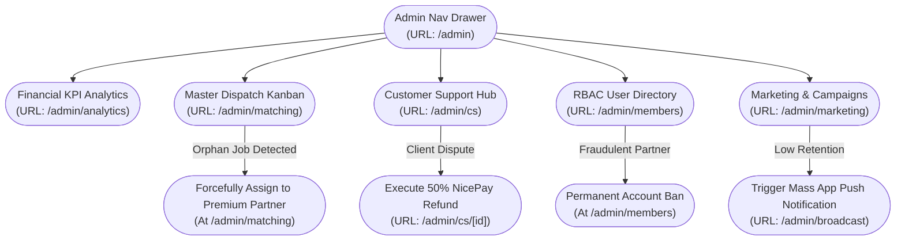

# ADMIN OPERATIONS FLOW (ENGLISH)

*Objective: Enable C-level visibility, kanban routing controls, and dispute mediation.*

```mermaid
graph TD
    A(["Admin Nav Drawer<br/>(URL: /admin)"]) --> B(["Financial KPI Analytics<br/>(URL: /admin/analytics)"])
    A --> C(["Master Dispatch Kanban<br/>(URL: /admin/matching)"])
    A --> D(["Customer Support Hub<br/>(URL: /admin/cs)"])
    A --> E(["RBAC User Directory<br/>(URL: /admin/members)"])
    A --> F(["Marketing & Campaigns<br/>(URL: /admin/marketing)"])
    
    C -->|Orphan Job Detected| G(["Forcefully Assign to Premium Partner<br/>(At /admin/matching)"])
    D -->|Client Dispute| H(["Execute 50% NicePay Refund<br/>(URL: /admin/cs/[id])"])
    E -->|Fraudulent Partner| I(["Permanent Account Ban<br/>(At /admin/members)"])
    F -->|Low Retention| J(["Trigger Mass App Push Notification<br/>(URL: /admin/broadcast)"])

```
