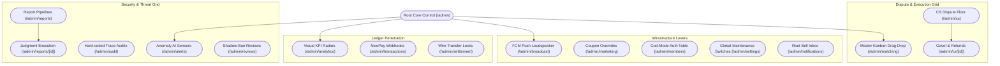

# FULL SITEMAP: ADMIN SUPREME CONTROLS
*Coverage: Aggregation, Legal, Governance logic grids (Total 17 Nodes)*

```mermaid
graph TD
    A(["Root Core Control (/admin)"])

    subgraph Core_Dispatch [Dispute & Execution Grid]
        D1(["Master Kanban Drag-Drop (/admin/matching)"])
        D2(["CS Dispute Floor (/admin/cs)"])
        D3(["Gavel & Refunds (/admin/cs/[id])"])
    end

    subgraph Analytic_Finance [Ledger Penetration]
        F1(["Visual KPI Radars (/admin/analytics)"])
        F2(["NicePay Webhooks (/admin/transactions)"])
        F3(["Wire Transfer Locks (/admin/settlement)"])
    end

    subgraph Moderation_Risk [Security & Threat Grid]
        R1(["Anomaly AI Sensors (/admin/alerts)"])
        R2(["Hard-coded Trace Audits (/admin/audit)"])
        R3(["Report Pipelines (/admin/reports)"])
        R4(["Judgment Execution (/admin/reports/[id])"])
        R5(["Shadow-Ban Reviews (/admin/reviews)"])
    end

    subgraph Global_Entity [Infrastructure Levers]
        M1(["FCM Push Loudspeaker (/admin/broadcast)"])
        M2(["Coupon Overrides (/admin/marketing)"])
        M3(["God-Mode Auth Table (/admin/members)"])
        S1(["Global Maintenance Switches (/admin/settings)"])
        N1(["Root Bell Inbox (/admin/notifications)"])
    end

    A --> F1 & D1 & R1 & M1
    D2 --> D3
    R3 --> R4
```