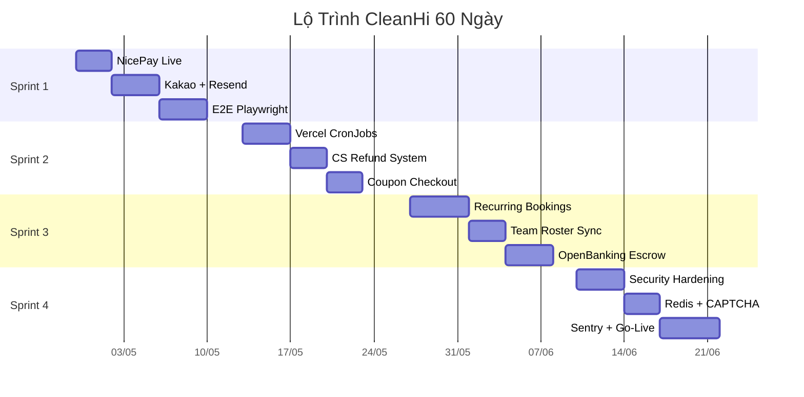

# SPRINT 4: KIỂM THỬ CHỊU TẢI & NHẤN NÚT GO-LIVE
*(Thời gian dự kiến: Tuần 7 - Tuần 8 | Ngày 43 đến Ngày 60)*

> **Nhiệm vụ trọng tâm**: Hoàn tất các tiêu chuẩn Doanh nghiệp. Trám lỗ hổng rò rỉ bộ nhớ, chống DDOS và Nhấn Nút kích hoạt Vercel Production Domain.

---

## 🎯 MỤC 1: Phủ Kín Lỗ Hổng Bảo Mật (Security Hardening)

**File liên quan**: `next.config.ts`, `src/config/security-headers.ts`

| Task | Mô Tả Chi Tiết | Ước Lượng |
|------|----------------|-----------|
| 1.1 | CSP Enforcing: Chuyển `Content-Security-Policy` từ `report-only` sang `enforce` | 0.5 ngày |
| 1.2 | Bật HSTS + X-Frame-Options + Referrer-Policy + Permissions-Policy | 0.5 ngày |
| 1.3 | GH Actions SHA pin: Thay 3 action dùng tag `@v4` bằng commit SHA cố định | 0.5 ngày |
| 1.4 | `pnpm lint` chuyển từ warning → error. Fix toàn bộ ~251 auto-fix + ~72 manual | 1 ngày |
| 1.5 | Server Action Audit: Rà soát 15 file action → báo cáo `server-action-audit.md` | 1 ngày |
| 1.6 | Xóa `package-lock.json` (npm CI references = 0, chỉ dùng pnpm) | 0.5 ngày |

---

## 🎯 MỤC 2: Tường Lửa Chịu Tải (Redis Rate Limit + CAPTCHA)

**File liên quan**: `src/lib/auth/rate-limit.ts`, `src/middleware.ts`

| Task | Mô Tả Chi Tiết | Ước Lượng |
|------|----------------|-----------|
| 2.1 | Đăng ký Upstash Redis → cấu hình env `UPSTASH_REDIS_REST_URL` + `TOKEN` | 0.5 ngày |
| 2.2 | Di dời rate-limit từ PostgreSQL `rate_limits` table → Upstash Redis sliding window | 1 ngày |
| 2.3 | Tích hợp Cloudflare Turnstile CAPTCHA vào form đăng ký Partner Application | 1 ngày |
| 2.4 | Load test: Giả lập 100 concurrent bid submissions → kiểm tra DB không deadlock | 1 ngày |

---

## 🎯 MỤC 3: Vòng Vây Bắt Lỗi (Error Monitoring)

**File liên quan**: `src/instrumentation.ts`, `sentry.client.config.ts` (tạo mới)

| Task | Mô Tả Chi Tiết | Ước Lượng |
|------|----------------|-----------|
| 3.1 | Đăng ký Sentry project → cấu hình `SENTRY_DSN` env | 0.5 ngày |
| 3.2 | Tích hợp `@sentry/nextjs`: Client + Server + Edge error capture | 1 ngày |
| 3.3 | Discord Webhook: Lỗi production → alert tức thì vào kênh #dev-alerts | 0.5 ngày |
| 3.4 | Source maps upload: Vercel build → Sentry release + source map | 0.5 ngày |

---

## 🎯 MỤC 4: Go/No-Go Launch Checklist

**File liên quan**: `docs/runbooks/launch-checklist.md`

| Task | Mô Tả Chi Tiết | Ước Lượng |
|------|----------------|-----------|
| 4.1 | Env Audit: Xác nhận tất cả 15+ env vars đã có trên Vercel Production | 0.5 ngày |
| 4.2 | `pnpm typecheck && pnpm lint && pnpm vitest run && pnpm build` → ALL GREEN | 0.5 ngày |
| 4.3 | Playwright E2E suite chạy full → 0 failures | 0.5 ngày |
| 4.4 | Binding custom domain `cleanhi.kr` + SSL cert + DNS verification | 0.5 ngày |
| 4.5 | Inject COMPANY env thật: CEO, business number, address, phone, ecommerce number | 0.5 ngày |
| 4.6 | Seed data: Service categories, coupons, admin account xác nhận OK | 0.5 ngày |
| 4.7 | Smoke test Production: Guest quote → Bid → Pay → Complete → Review (full cycle) | 1 ngày |
| 4.8 | Bàn giao source code + tài liệu cho Chủ Tịch. RÚT QUÂN! 🎉 | 0.5 ngày |

---

> 💡 **Cách ra lệnh**: Sếp nhắn *"Tiến hành Sprint 4 - Mục 1"* hoặc *"Sprint 4 - Mục 4"*, tôi sẽ tự bóc Code đè vào hệ thống theo đúng Task list!

---

## 📊 TỔNG KẾ HOẠCH TOÀN CẢNH 60 NGÀY

