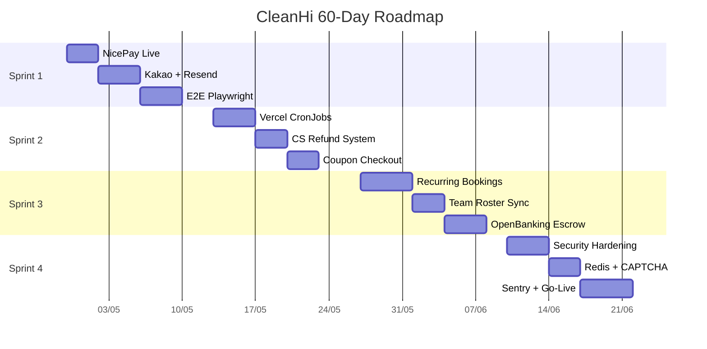

# SPRINT 4: LOAD TESTING & PRESSING THE GO-LIVE BUTTON
*(Estimated Timeline: Week 7 – Week 8 | Day 43 to Day 60)*

> **Core Mission**: Complete enterprise-grade standards. Seal memory leak holes, defend against DDoS, and press the Vercel Production Domain activation button.

---

## 🎯 OBJECTIVE 1: Sealing Security Vulnerabilities (Security Hardening)

**Related Files**: `next.config.ts`, `src/config/security-headers.ts`

| Task | Detailed Description | Estimate |
|------|---------------------|----------|
| 1.1 | CSP Enforcing: Switch `Content-Security-Policy` from `report-only` to `enforce` | 0.5 day |
| 1.2 | Enable HSTS + X-Frame-Options + Referrer-Policy + Permissions-Policy | 0.5 day |
| 1.3 | GH Actions SHA pin: Replace 3 actions using tag `@v4` with fixed commit SHAs | 0.5 day |
| 1.4 | `pnpm lint` switch from warning → error. Fix all ~251 auto-fix + ~72 manual | 1 day |
| 1.5 | Server Action Audit: Review 15 action files → produce `server-action-audit.md` report | 1 day |
| 1.6 | Delete `package-lock.json` (npm CI references = 0, pnpm only) | 0.5 day |

---

## 🎯 OBJECTIVE 2: Load-Bearing Firewall (Redis Rate Limit + CAPTCHA)

**Related Files**: `src/lib/auth/rate-limit.ts`, `src/middleware.ts`

| Task | Detailed Description | Estimate |
|------|---------------------|----------|
| 2.1 | Register Upstash Redis → configure env `UPSTASH_REDIS_REST_URL` + `TOKEN` | 0.5 day |
| 2.2 | Migrate rate-limit from PostgreSQL `rate_limits` table → Upstash Redis sliding window | 1 day |
| 2.3 | Integrate Cloudflare Turnstile CAPTCHA into Partner Application signup form | 1 day |
| 2.4 | Load test: Simulate 100 concurrent bid submissions → verify DB has no deadlocks | 1 day |

---

## 🎯 OBJECTIVE 3: Bug Hunting Perimeter (Error Monitoring)

**Related Files**: `src/instrumentation.ts`, `sentry.client.config.ts` (new)

| Task | Detailed Description | Estimate |
|------|---------------------|----------|
| 3.1 | Register Sentry project → configure `SENTRY_DSN` env | 0.5 day |
| 3.2 | Integrate `@sentry/nextjs`: Client + Server + Edge error capture | 1 day |
| 3.3 | Discord Webhook: Production errors → instant alert to #dev-alerts channel | 0.5 day |
| 3.4 | Source maps upload: Vercel build → Sentry release + source map | 0.5 day |

---

## 🎯 OBJECTIVE 4: Go/No-Go Launch Checklist

**Related Files**: `docs/runbooks/launch-checklist.md`

| Task | Detailed Description | Estimate |
|------|---------------------|----------|
| 4.1 | Env Audit: Confirm all 15+ env vars are set on Vercel Production | 0.5 day |
| 4.2 | `pnpm typecheck && pnpm lint && pnpm vitest run && pnpm build` → ALL GREEN | 0.5 day |
| 4.3 | Playwright E2E suite full run → 0 failures | 0.5 day |
| 4.4 | Bind custom domain `cleanhi.kr` + SSL cert + DNS verification | 0.5 day |
| 4.5 | Inject real COMPANY env: CEO, business number, address, phone, ecommerce number | 0.5 day |
| 4.6 | Seed data: Service categories, coupons, admin account confirmed OK | 0.5 day |
| 4.7 | Smoke test Production: Guest quote → Bid → Pay → Complete → Review (full cycle) | 1 day |
| 4.8 | Handover source code + documentation to Chairman. MISSION COMPLETE! 🎉 | 0.5 day |

---

> 💡 **How to execute**: Boss says *"Execute Sprint 4 - Objective 1"* or *"Sprint 4 - Objective 4"*, and I'll auto-apply code changes to the system following the exact task list!

---

## 📊 60-DAY MASTER PLAN OVERVIEW

